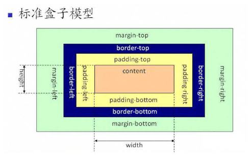
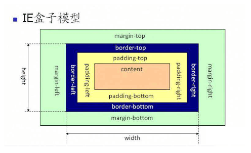

# 几种盒模型

## 标准盒模型



```css
.box {
  box-sizing: content-box;
}
```

在标准模式下，一个块的总宽度= width + margin(左右) + padding(左右) + border(左右)

## IE 盒子模型



```css
.box {
  box-sizing: border-box;
}
```

在怪异模式下，一个块的总宽度= width + margin(左右)（即 width 已经包含了 padding 和 border 值）

## flex 盒模型


```css
.box {
  display: flex;
}
```
